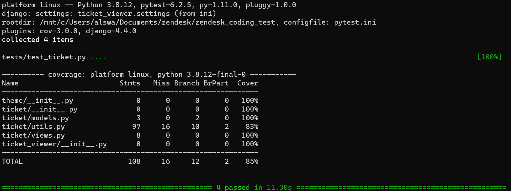

# Readme for Zendesk Coding

## Configure /ZENDESK_CODING_TEST/ticket_viewer/.env.template!

### Deployed example:

[http://3.96.80.18:8004/](http://3.96.80.18:8004/?page=1)

## Run within Container

### Prerequisites

- Docker
- Docker Compose

### Run the following Script

```bash
docker-compose up --build -d
```

Go to localhost:8004

## Run within Ubuntu or WSL-Ubuntu

### Prerequisites

- Python (^3.8)
- Poetry
- make

### Run the following Script

```bash
apt-get update && apt-get -y install netcat gcc make && apt-get clean
pip install poetry==1.1.11
poetry install

# This repo runs a lot of scripts using the Makefile, so please read it to understand 
# what these commands do
# just run tests, can put .env details in CLI if you don't want to configure it.
make demo-script-test

# run the app, can put .env details in CLI if you don't want to configure it.
make demo-script-run

# before committing changes, run the following and make sure everything passes
make pre-commit
make test
```

**Go to localhost:8000**

### Viable pages:

[localhost:8000](http://localhost:8000) [list view]

[localhost:8000/ticket/<int:ticket_id>](http://localhost:8000/ticket/<int:ticket_id>) [detail view]

HTML Templates Sourced and Inspired by the wonderful people at [Tailblocks](https://web.archive.org/web/20211115132515/https://tailblocks.cc/).

Current output of make test command



The backend works on these main functions in zendesk-conding-test/ticket/utils.py:

```bash
import datetime
import os
import traceback
from math import ceil

import requests

# offset per paginated request
PER_PAGE = 25

# queries for group names
def get_group_name(group_id):
    try:
        ZENDESK_PASSWORD = os.environ.get("ZENDESK_PASSWORD")
        ZENDESK_USER = os.environ.get("ZENDESK_USER")
        ZENDESK_URL = os.environ.get("ZENDESK_URL") + f"/api/v2/groups/{group_id}"
        response = requests.get(ZENDESK_URL, auth=(ZENDESK_USER, ZENDESK_PASSWORD))
        resp = response.json()
        return resp["group"]["name"]
    except Exception:
        return None

# queries for user_ids
def get_user_name(user_id):
    try:
        ZENDESK_PASSWORD = os.environ.get("ZENDESK_PASSWORD")
        ZENDESK_USER = os.environ.get("ZENDESK_USER")
        ZENDESK_URL = os.environ.get("ZENDESK_URL") + f"/api/v2/users/{user_id}"
        response = requests.get(ZENDESK_URL, auth=(ZENDESK_USER, ZENDESK_PASSWORD))
        resp = response.json()
        return resp["user"]["name"]
    except Exception:
        return None

# queries total count of users
def ticket_count():
    try:
        ZENDESK_PASSWORD = os.environ.get("ZENDESK_PASSWORD")
        ZENDESK_URL = os.environ.get("ZENDESK_URL") + "/api/v2/tickets/count.json"
        ZENDESK_USER = os.environ.get("ZENDESK_USER")
        response = requests.get(
            ZENDESK_URL, auth=(ZENDESK_USER, ZENDESK_PASSWORD)
        ).json()
        return int(response["count"]["value"])
    except Exception:
        return None

# creates data loaded in list view
def create_ticket_list_context(page=1):
    ZENDESK_PASSWORD = os.environ.get("ZENDESK_PASSWORD")
		# data passed within list view
    context = dict()
    context["error"] = False
    count = ticket_count()
    if count is None:
        context["error"] = True
        context[
            "error_message"
        ] = """
                😅 Ticket count is currently unavailable.
                That means the API may not be available.
                Try again in a few minutes or contact asw15@sfu.ca for assistance.
            """
        return context
    current_page = min(ceil(ticket_count() / PER_PAGE), max(int(page), 1))
    ZENDESK_URL = (
        os.environ.get("ZENDESK_URL")
        + "/api/v2/tickets.json?per_page="
        + str(PER_PAGE)
        + "&page="
        + str(current_page)
    )
    ZENDESK_USER = os.environ.get("ZENDESK_USER")

    response = requests.get(ZENDESK_URL, auth=(ZENDESK_USER, ZENDESK_PASSWORD))

    if response.status_code != 200:
        context["error"] = True
        context[
            "error_message"
        ] = f"""
                😅 This GET request came back with code {response.status_code}.
                That means your tickets may not be available.
                Try again in a few minutes or contact asw15@sfu.ca for assistance.
            """
        return context
    try:
        resp = response.json()
        context["tickets"] = resp["tickets"]
        for ticket in context["tickets"]:
            ticket["updated_at"] = datetime.datetime.strptime(
                ticket["updated_at"], "%Y-%m-%dT%H:%M:%SZ"
            )
            ticket["created_at"] = datetime.datetime.strptime(
                ticket["created_at"], "%Y-%m-%dT%H:%M:%SZ"
            )
        context["has_less"] = current_page > 1
        context["prev_page"] = current_page - 1
        context["has_more"] = ceil(count / PER_PAGE) > page
        context["next_page"] = current_page + 1
        context["current_page"] = current_page
        context["max"] = ceil(count / PER_PAGE)
        context["count_in_page"] = len(context["tickets"])
        context["count_all"] = count
    except Exception:
        context["error"] = True
        context[
            "error_message"
        ] = f"""
                😅 Something unexpected went wrong. Here's the 
                error stack {traceback.format_exc()}. Try again in a few minutes or contact 
                asw15@sfu.ca for assistance.
            """
    return context

def create_ticket_detail_context(page=1, ticket_id=1):
    ZENDESK_PASSWORD = os.environ.get("ZENDESK_PASSWORD")
    ZENDESK_USER = os.environ.get("ZENDESK_USER")
    ZENDESK_URL = os.environ.get("ZENDESK_URL") + f"/api/v2/tickets/{ticket_id}"
    response = requests.get(ZENDESK_URL, auth=(ZENDESK_USER, ZENDESK_PASSWORD))
    context = dict()
    context["error"] = False
    if response.status_code == 404:
        context["error"] = True
        context[
            "error_message"
        ] = """
                😅 This ticket does not exist.
                If you think this is wrong, contact asw15@sfu.ca for assistance.
            """
        return context
    if response.status_code != 200:
        context["error"] = True
        context[
            "error_message"
        ] = f"""
                😅 This GET request came back with code {response.status_code}.
                That means your tickets may not be available.
                Try again in a few minutes or contact asw15@sfu.ca for assistance.
            """
        return context
    try:
        resp = response.json()
        context["ticket"] = resp["ticket"]

        context["ticket"]["group_name"] = get_group_name(resp["ticket"]["group_id"])
        context["ticket"]["requester_name"] = get_user_name(
            resp["ticket"]["requester_id"]
        )

        context["ticket"]["updated_at"] = datetime.datetime.strptime(
            context["ticket"]["updated_at"], "%Y-%m-%dT%H:%M:%SZ"
        )
        context["ticket"]["created_at"] = datetime.datetime.strptime(
            context["ticket"]["created_at"], "%Y-%m-%dT%H:%M:%SZ"
        )
        context["back_value"] = page
    except Exception:
        context["error"] = True
        context[
            "error_message"
        ] = f"""
                😅 Something unexpected went wrong. Here's the 
                error stack {traceback.format_exc()}. Try again in a few minutes or contact 
                asw15@sfu.ca for assistance.
            """
    return context
```

Offset pagination is used as it is simpler to implement and perfectly suitable for splitting data in a CRM table view type setting.